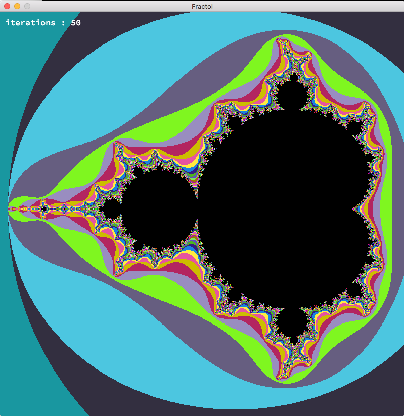
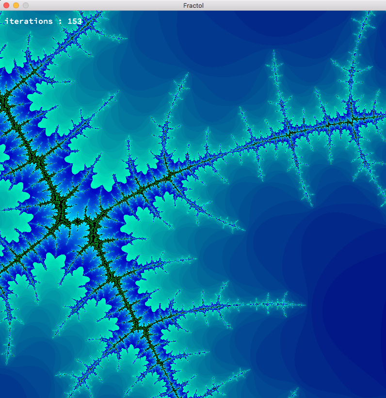
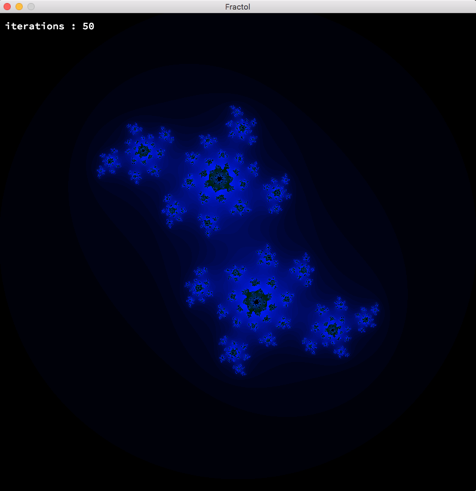
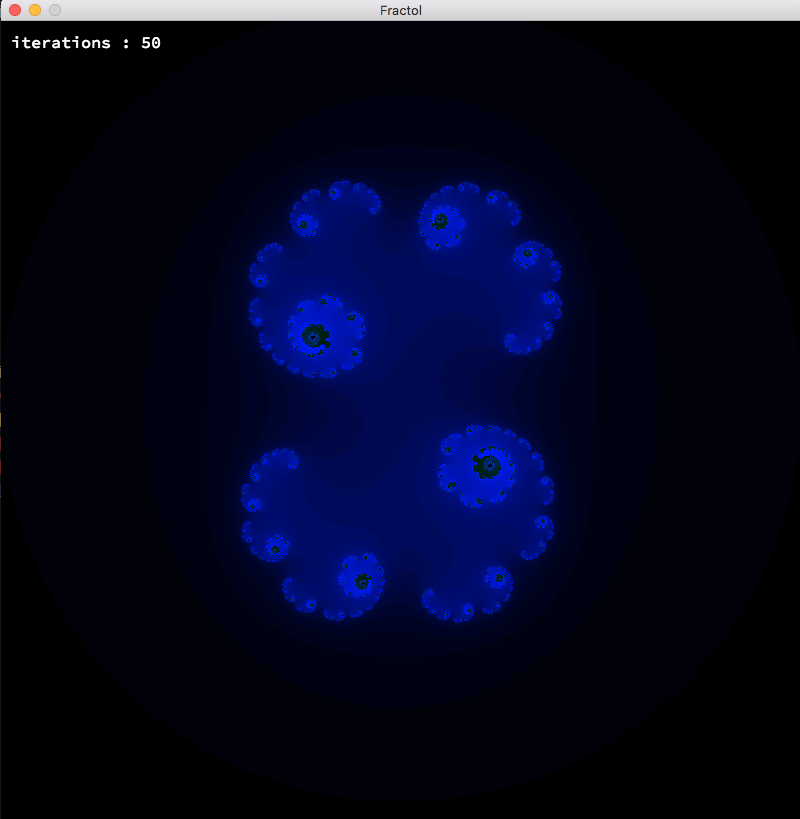
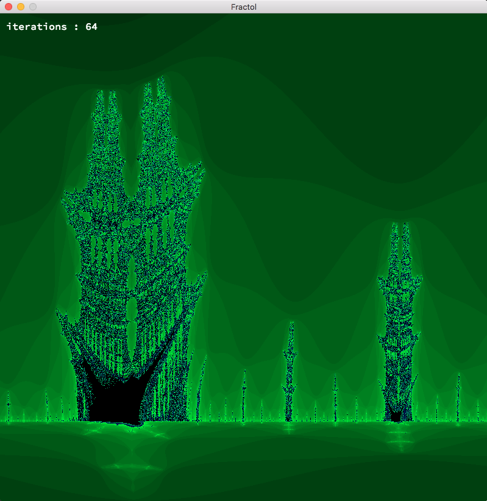

  2nd project of the Graphic Branch of 42. Fractol is a project aimed at exploring fractals, 
  mathematical sets that exhibit a repeating pattern displayed at every scale.
  
  
   
    
     
      
     
